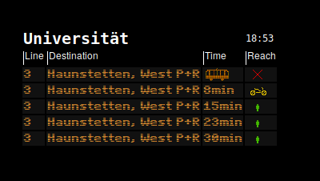

<h1> AVV-EFA-Timetable

General:
-------
This small and simple python application displays EFA content. Its by default configured to capture stations of the "Augsburger Verkehrs Verbund".

Configure:
---------
To edit station,line codes and walk/drive times to station edit constants in back_end.py.
Install font from ./res/font folder.
To display content from other providers just modify the HTTP-requests.

Run:
---
To run AVV-EFA-Timetable <code class="shell">python main.py</code>

Dependencies:
------------
htmlPy
- Ubuntu: <code class="shell">sudo pip install htmlPy</code>

Pyside:
- Ubuntu: <code class="shell"> sudo apt-get install python-pyside</code>

Python-QT
- Ubuntu: <code class="shell">sudo aptitude install python-qt4</code>

Screenshots:
-----------

